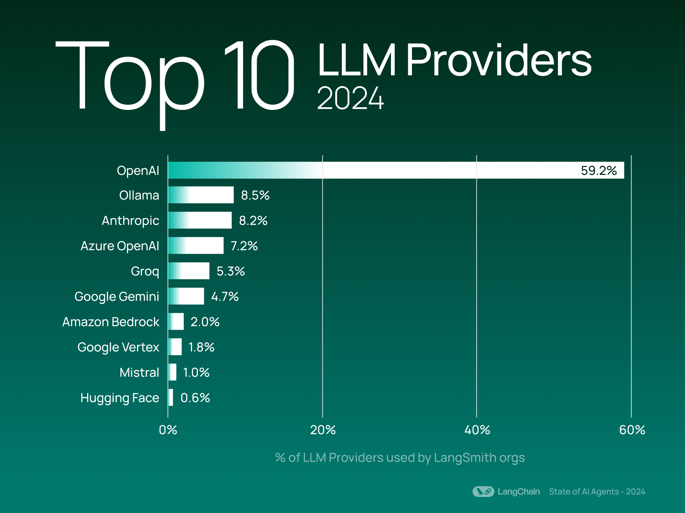
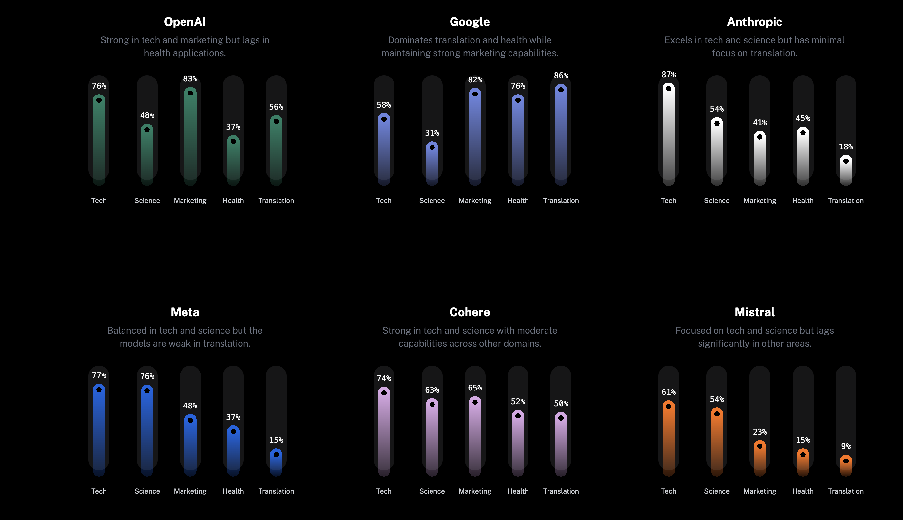
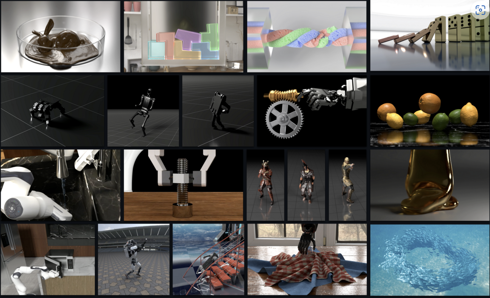
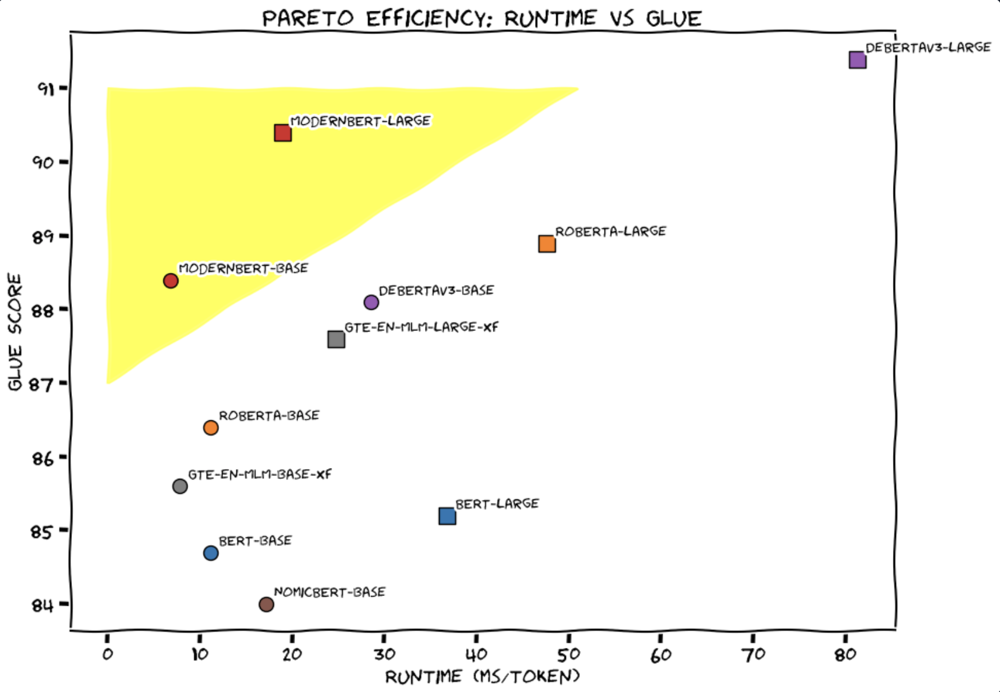

# Weekly AI Agents report
December 23, 2024

## Surveys:
- [**LangChain State of AI 2024**](https://blog.langchain.dev/langchain-state-of-ai-2024/)  highlights significant trends in AI application development. OpenAI remains the leading LLM provider among LangSmith users, with usage exceeding that of the next provider by sixfold. Notably, there is a growing interest in open-source models, with providers like Ollama and Groq gaining traction. The report also observes an increase in AI agent applications, with 43% of LangSmith organizations utilizing LangGraph for complex tasks, reflecting a shift towards more dynamic, multi-step workflows in AI development.

- [**Langbase State of AI Agents 2024**](https://langbase.com/state-of-ai-agents) gathered insights from over 3,400 developers across 100+ countries, with 46% holding C-level positions, highlighting AI’s significance at the executive level.  OpenAI leads as the top AI/LLM provider, with Google closing the gap and Anthropic gaining traction.  Developers rely heavily on OpenAI for AI and LLM services, but Google is quickly emerging as a strong competitor.  The study also identifies key concerns hindering AI adoption, including complexity in scaling and deployment, data privacy and security compliance, lack of robust observability and monitoring tools, and high infrastructure costs.

## Events:
- [**Microsoft launched GitHub Copilot Free for VS Code**](https://github.com/features/copilot/plans?cft=copilot_li.features_copilot&utm_campaign=social_ms). Includes up to 2,000 completions and 50 chat requests per month
- [**Genesis project**](https://github.com/Genesis-Embodied-AI/Genesis) an advanced physics platform tailored for general-purpose robotics and embodied AI applications. It features a universal physics engine capable of simulating a diverse range of materials and physical phenomena, a user-friendly robotics simulation environment, and a high-speed photorealistic rendering system. Notably, Genesis supports generative simulation, integrating generative AI with physics-based simulations to automate the creation of diverse environments, tasks, and training data for embodied AI agents.

- [**AnswerAI trained a Replacement for BERT**](https://huggingface.co/blog/modernbert) ModernBERT is a new family of state-of-the-art encoder-only models designed to replace older generation encoders like BERT. It offers an extended sequence length of 8192 tokens, improved downstream performance, and significantly faster processing speeds. ModernBERT is available in both base (139 million parameters) and large (395 million parameters) model sizes, serving as a direct replacement for BERT-like models in various applications. Notably, ModernBERT does not use token type IDs, simplifying its integration into existing workflows.

- [**OpenAI’s “12 Days of OpenAI”**](https://openai.com/12-days/) event, which began on December 5, 2024, features daily announcements of new features, products, and demos. Here’s a summary of the releases so far:
    - Day 1: Introduced ChatGPT Pro, offering enhanced access to GPT-4o and an exclusive version of the o1 reasoning model. 
    - Day 2: Expanded alpha access to the Reinforcement Fine-Tuning Research Program, inviting researchers, universities, and enterprises to apply.
    - Day 3: Launched Sora, a text-to-video AI tool that enables users to create  from text inputs.
    - Day 4: Highlighted Canvas, an interface for collaborative writing and codinitially launched in October 2024.
    - Day 5: Announced integration of ChatGPT with Apple Intelligence, enhancing  Apple devices.
    - Day 6: Released Advanced Voice with Video & Santa Mode, introducing new voifestive mode for ChatGPT.
    - Day 7: Introduced Projects in ChatGPT, allowing users to manage and organizn the platform.
    - Day 8: Showcased ChatGPT Search, a feature providing timely answers from re, first introduced in October 2024.
    - Day 9: Unveiled OpenAI o1 and new tools for developers, including Realtime nd a new fine-tuning method.
    - Day 10: Launched 1-800-CHATGPT, a service providing users with access to Chted phone line.
    - Day 11: Introduced Work with Apps, enabling seamless integration of ChatGPTications to enhance productivity.

## Tutorials:
- **LlamaIndex: Building a Multi-Agent Framework from Scratch** https://github.com/YukoOshima/Blog/blob/main/articles/multi_agents.md is a step-by-step guide to developing a multi-agent system capable of generating high-quality Anki flashcards from any given text. The tutorial begins with a basic single-agent system and progressively incorporates more agents, each with specialized functions, to enhance the system’s capabilities. This approach mirrors assembling a team where each member contributes unique expertise to achieve complex tasks. The complete source code for this project is available in the author’s GitHub repository. 
- **DeeplearningAi: Reasoning with o1**: https://www.deeplearning.ai/short-courses/reasoning-with-o1/ is a short course offered by DeepLearning.AI in collaboration with OpenAI, focusing on effectively utilizing OpenAI’s o1 model for complex reasoning tasks. Taught by Colin Jarvis, Head of AI Solutions at OpenAI. 
- **DeeplearningAi: Collaborative Writing and Coding with OpenAI Canvas** https://www.deeplearning.ai/short-courses/collaborative-writing-and-coding-with-openai-canvas/ s a short course by DeepLearning.AI, led by Karina Nguyen, Research Lead at OpenAI. The course introduces OpenAI Canvas, a user-friendly interface that enables users to brainstorm, draft, and refine text and code in collaboration with ChatGPT. 
- **Google: Introduction to Gemini 2.0 Flash Thinking** https://github.com/google-gemini/cookbook/blob/main/gemini-2/thinking.ipynb provides a comprehensive guide on implementing advanced reasoning capabilities using the Gemini 2 model. It demonstrates techniques such as step-by-step problem-solving, handling complex queries, and integrating external knowledge sources to enhance the model’s performance in reasoning tasks. 
- **Anthropic: Building Effective Agents Cookbook** https://github.com/anthropics/anthropic-cookbook/tree/main/patterns/agents development of agentic systems using large language models (LLMs). It distinguishes between workflows—predefined sequences of tasks—and agents, which dynamically determine their processes and tool usage. The tutorial emphasizes starting with simple solutions, such as directly using LLM APIs, and increasing complexity only when necessary. It also highlights the importance of tailoring LLM capabilities to specific use cases and ensuring easy integration with tools.
