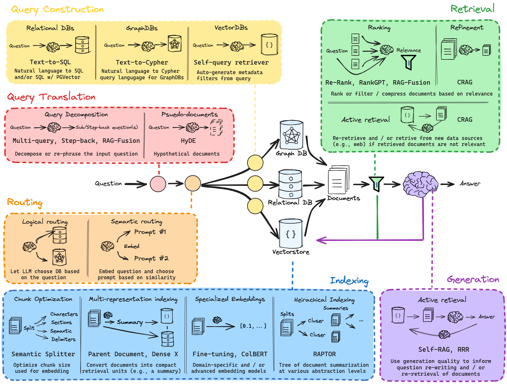

# Weekly AI Agents report
December 30, 2024

## Tools
- [**Open Canvas**](https://github.com/langchain-ai/open-canvas?tab=readme-ov-file) is an open source web application for collaborating with agents to better write documents. It is inspired by OpenAI's "Canvas", but with a few key differences.
- [**Google: gemini 2.0 flash thinking**](https://huggingface.co/spaces/akhaliq/anychat) on Hugging Face Anychat. 
- [**Jupyter Agent**](https://huggingface.co/spaces/data-agents/jupyter-agent) on Hugging Face Spaces.

## Tutorials
- [**How to fine-tune open LLMs in 2025 with Hugging Face**](https://www.philschmid.de/fine-tune-llms-in-2025) provides a comprehensive guide on customizing large language models for specialized tasks. It covers defining appropriate use cases for fine-tuning, setting up the development environment, preparing datasets, and utilizing advanced techniques like QLoRA and Spectrum for efficient model training. Additionally, the tutorial discusses optimization strategies, including Flash Attention and Liger Kernels, and scaling training across multiple GPUs using DeepSpeed.
- [**Building an LLM Agent to Find Relevant Research Papers from Arxiv**](https://github.com/mistralai/cookbook/blob/main/third_party/LlamaIndex/llamaindex_arxiv_agentic_rag.ipynb) demonstrates how to implement an agentic retrieval-augmented generation (RAG) system using LlamaIndex. This system enables dynamic retrieval of relevant information from the arXiv dataset to enhance the generation capabilities of language models. By integrating LlamaIndex with the arXiv dataset, the notebook showcases the process of building a more intelligent and context-aware AI application.
-[**GenerativeAI Generative AI for Everyone**](https://www.coursera.org/learn/generative-ai-for-everyone?utm_campaign=coursera-campaign-social&utm_medium=institutions&utm_source=deeplearning-ai) is a beginner-level course taught by AI pioneer Andrew Ng, designed to demystify generative artificial intelligence and its applications. The course covers how generative AI works, its common use cases, and guides learners through the lifecycle of a generative AI project, including effective prompt engineering. With approximately 5 hours of content, it aims to empower individuals and businesses to harness AI’s potential responsibly and effectively. 
- [**Cameron R. Wolfe’s A Practitioners Guide to Retrieval Augmented Generation (RAG)**](https://cameronrwolfe.substack.com/p/a-practitioners-guide-to-retrieval?utm_source=profile&utm_medium=reader2) delves into the integration of retrieval mechanisms with generative AI models to enhance their performance. The article discusses the benefits of combining retrieval-based methods with generative models, such as improved accuracy and relevance in AI-generated content. Wolfe also explores practical applications and considerations for implementing retrieval-augmented generation in real-world AI systems.
- [**Langchain RAG From Scratch**](https://github.com/langchain-ai/rag-from-scratch) LLMs are trained on a large but fixed corpus of data, limiting their ability to reason about private or recent information. Fine-tuning is one way to mitigate this, but is often not well-suited for facutal recall and can be costly. Retrieval augmented generation (RAG) has emerged as a popular and powerful mechanism to expand an LLM's knowledge base, using documents retrieved from an external data source to ground the LLM generation via in-context learning. These notebooks accompany a video playlist that builds up an understanding of RAG from scratch, starting with the basics of indexing, retrieval, and generation.

## Events
- [**OpenAI's "12 Days of OpenAI"**](https://openai.com/12-days/) event, which began on December 5, 2024, features daily announcements of new features, products, and demos. On the last, 12-th day, new reasoning o3 model was introduced.

- [**LLM Consortium Plugin**](https://github.com/irthomasthomas/karpathy-consortium) enables simultaneous querying of multiple language models, collecting their responses, and evaluating them based on confidence levels. An arbiter model then selects or synthesizes the best response, facilitating more accurate and reliable outputs. Users can install the plugin via pip install llm-consortium and utilize it through the command line or programmatically. 
- [**Langchain AgentWrite LangGraph**](https://github.com/samwit/agent_tutorials/tree/main/agent_write) repository by Sam Witteveen, which offers various tutorials on AI agents. While the repository provides tutorials on building and training LangGraph agents, implementing CrewAI agents, and developing AutoGen agents, specific details about the agent_write module are not provided in the available information.
- [**Simon: OpenAI-openapi**](https://simonwillison.net/2024/Dec/22/openai-openapi/) highlights that OpenAI maintains an OpenAPI YAML specification of their API, available in the openai-openapi repository on GitHub. This comprehensive file, exceeding 26,000 lines, defines 76 API endpoints and 284 schemas for JSON interactions. To facilitate easier navigation, Willison developed a rudimentary YAML explorer tool, allowing users to expand and collapse sections of the specification for better readability.

## Surveys
- [**The State of AI Startups**](https://www.latent.space/p/2024-startups) highlights that the landscape of AI models has become more competitive, with open-source and smaller models showing remarkable progress, significantly reducing the cost and accessibility barriers for AI adoption. New modalities such as voice, biology, and video are gaining traction, while foundational shifts in AI applications and infrastructure, like the rise of service automation and outcome-based pricing, redefine market opportunities. The report emphasizes that despite the dominance of large incumbents, startups have a favorable environment to thrive, leveraging agility and innovation in untapped markets and unique product offerings.
- [**CrewAI Multi AI Agents In Production**](https://insights.crewai.com/) a recent survey of over 4,500 professionals reveals that enterprises are rapidly deploying AI agents, focusing initially on internal processes before advancing to high-precision applications. Notably, larger companies have 23% more AI use cases in production compared to smaller counterparts, with technical teams favoring tools like CrewAI Flows for enhanced control.  Additionally, the most utilized language models include OpenAI’s GPT series, Azure’s GPT-4o, and Groq’s Llama3 variants.
- [**Google 321 real-world gen AI use cases from the world's leading organizations**](https://cloud.google.com/transform/101-real-world-generative-ai-use-cases-from-industry-leaders?utm_source=twitter&utm_medium=unpaidsoc&utm_campaign=fy24q4-googlecloud-blog-ai-in_feed-no-brand-global&utm_content=-&linkId=12159742) showcases how organizations across various sectors are leveraging generative AI to enhance productivity, automate processes, and improve customer experiences. Highlighted applications include Alaska Airlines’ development of a natural language search chatbot to streamline travel booking, Bennie Health’s use of Vertex AI to provide actionable insights in employee health benefits, and Formula E’s AI-driven summarization of race commentaries into concise, multilingual podcasts.

## Conversations
- [**Building Anthropic | A conversation with our co-founders**](https://www.youtube.com/watch?v=om2lIWXLLN4) a discussion of shared journey in advancing safe and responsible AI. They discuss the challenges of scaling AI while addressing safety concerns, the origins and impact of initiatives like the Responsible Scaling Policy, and their collaborative culture focused on unity, pragmatism, and mission alignment. Their vision emphasizes using AI to address global challenges, enhance safety, and drive a positive societal impact through innovation and responsibility.

## Papers
- [**A Survey on LLM Inference-Time Self-Improvement**](https://arxiv.org/pdf/2412.14352) by Xiangjue Dong, Maria Teleki, and James Caverlee provides a comprehensive review of techniques that enhance large language models (LLMs) during inference without altering their parameters or requiring additional training.  The authors categorize these methods into three main approaches: independent self-improvement, context-aware self-improvement, and model-aided self-improvement. 
- [**Qwen2.5 Technical Report**](https://arxiv.org/pdf/2412.15115) introduces Qwen2.5, a series of large language models developed by the Qwen Team. These models have been enhanced through extensive pre-training on 18 trillion tokens and refined post-training, including supervised fine-tuning and reinforcement learning, to improve capabilities in reasoning, mathematics, coding, and human preference alignment. The Qwen2.5 series offers models in various sizes, from 0.5B to 72B parameters, with open-weight versions available for public access, and demonstrates competitive performance against state-of-the-art models like Llama-3-405B-Instruct.
- [**OpenAI deliberative alignment: reasoning enables safer language models**](https://openai.com/index/deliberative-alignment/) a training method that teaches language models explicit safety specifications and trains them to reason through these guidelines before responding. This approach enables models to reflect on user prompts, identify relevant safety policies, and generate safer outputs, enhancing adherence to safety standards. Models trained with deliberative alignment, such as OpenAI’s o-series, have demonstrated superior performance on various safety benchmarks compared to previous models.
- [**The Surprising Effectiveness of Test-Time Training for Abstract Reasoning**](https://arxiv.org/pdf/2411.07279) nvestigates how test-time training (TTT)—temporarily updating model parameters during inference using a loss derived from input data—can enhance language models’ reasoning capabilities, particularly on tasks requiring complex reasoning beyond their training distribution. Using the Abstraction and Reasoning Corpus (ARC) as a benchmark, the authors identify three crucial components for successful TTT: initial fine-tuning on similar tasks, appropriate auxiliary task formats and augmentations, and per-instance training. Their findings demonstrate that TTT significantly improves performance on ARC tasks, achieving up to sixfold accuracy improvements compared to base fine-tuned models, and setting new state-of-the-art results for purely neural approaches.
- [**Tree-of-Code: A Hybrid Approach for Robust Complex Task Planning and Execution**](https://arxiv.org/pdf/2412.14212) introduces Tree-of-Code (ToC), a novel method that integrates the strengths of Tree-of-Thought and CodeAct to enhance large language models’ (LLMs) capabilities in complex task planning and execution. By treating each code execution result as a node in a decision tree and employing a breadth-first search strategy, ToC explores potential solutions, with the final outcome determined through a voting mechanism based on node outputs. Experimental results demonstrate that ToC provides more stable results compared to Tree-of-Thought and achieves higher accuracy than CodeAct in complex task scenarios. 